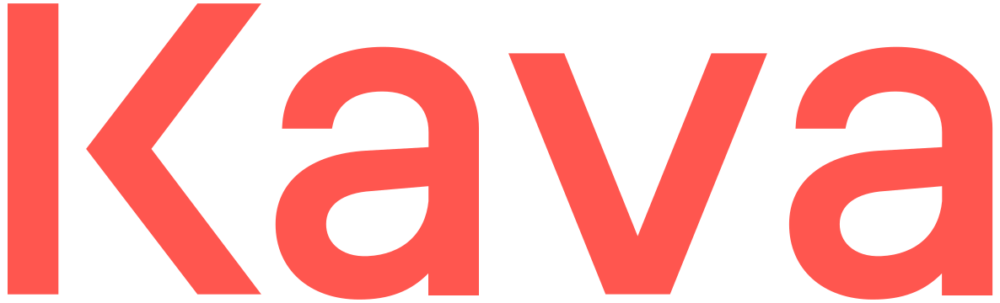

<p align="center">
  
</p>

<div align="center">

[](https://github.com/incubus-network/fury/releases/latest)
[](https://circleci.com/gh/Incubus-Network/fury/tree/master)
[](https://goreportcard.com/report/github.com/incubus-network/fury)
[](https://godoc.org/github.com/Incubus-Network/fury)
[](https://github.com/Incubus-Network/fury/blob/master/LICENSE.md)
[](https://twitter.com/FURY_CHAIN)
[](https://discord.com/invite/kQzh3Uv)

</div>

<div align="center">

### [Telegram](https://t.me/furylabs) | [Medium](https://medium.com/incubus-network) | [Discord](https://discord.gg/JJYnuCx)

</div>

Reference implementation of Fury, a blockchain for cross-chain DeFi. Built using the [cosmos-sdk](https://github.com/cosmos/cosmos-sdk).

## Mainnet

The current recommended version of the software for mainnet is [v0.23.0](https://github.com/Incubus-Network/fury/releases/tag/v0.23.0). The master branch of this repository often contains considerable development work since the last mainnet release and is __not__ runnable on mainnet.

### Installation and Setup
For detailed instructions see [the Fury docs](https://docs.fury.io/docs/participate/validator-node).

```bash
git checkout v0.23.0
make install
```

End-to-end tests of Fury use a tool for generating networks with different configurations: [futool](https://github.com/Incubus-Network/futool).
This is included as a git submodule at [`tests/e2e/futool`](tests/e2e/futool/).
When first cloning the repository, if you intend to run the e2e integration tests, you must also
clone the submodules:
```bash
git clone --recurse-submodules https://github.com/Incubus-Network/fury.git
```

Or, if you have already cloned the repo: `git submodule update --init`

## Testnet

For further information on joining the testnet, head over to the [testnet repo](https://github.com/Incubus-Network/fury-testnets).

## Docs

Fury protocol and client documentation can be found in the [Fury docs](https://docs.fury.io).

If you have technical questions or concerns, ask a developer or community member in the [Fury discord](https://discord.com/invite/kQzh3Uv).

## Security

If you find a security issue, please report it to security [at] fury.io. Depending on the verification and severity, a bug bounty may be available.

## License

Copyright © Fury Labs, Inc. All rights reserved.

Licensed under the [Apache v2 License](LICENSE.md).
